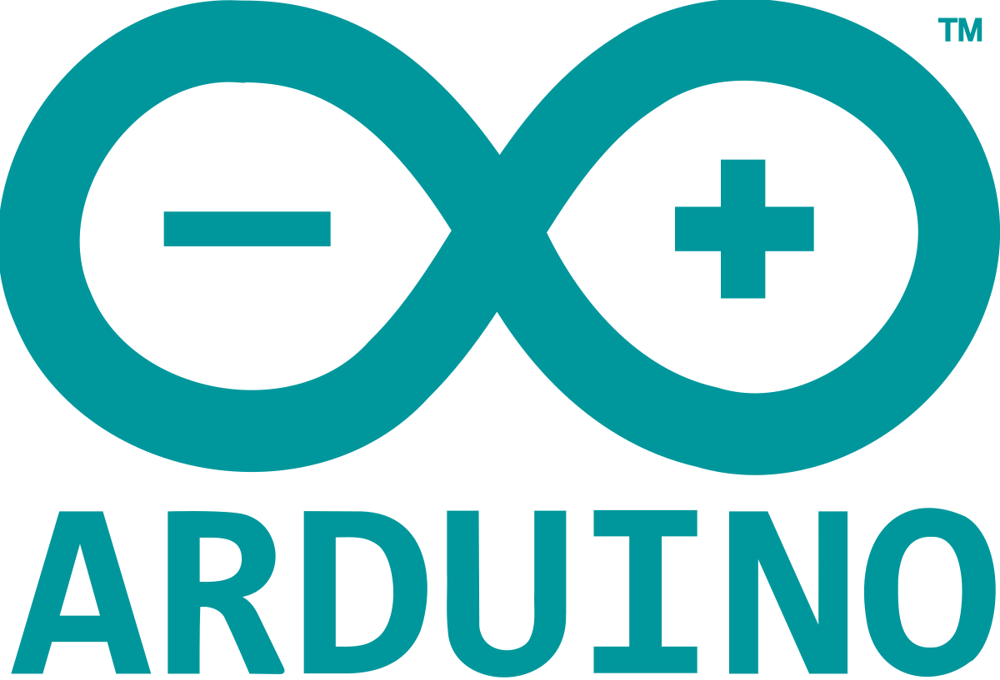

<a name="readme-top"></a>

[![Contributors][contributors-shield]][contributors-url]
[![Forks][forks-shield]][forks-url]
[![Stargazers][stars-shield]][stars-url]
[![Issues][issues-shield]][issues-url]


<!-- PROJECT LOGO -->
<br />
<div align="center">
  <a href="https://github.com/YuToutCourt/KeyLogger_USB">
    
  </a>

  <h3 align="center">KeyLogger</h3>

  <p align="center">
    A KeyLogger USB, with Arduino
    <br />
    <a href="https://github.com/YuToutCourt/KeyLogger_USB"><strong>Explore the docs »</strong></a>
    <br />
    <br />
    <a href="https://github.com/YuToutCourt/KeyLogger_USB">View Demo</a>
    ·
    <a href="https://github.com/YuToutCourt/KeyLogger_USB/issues">Report Bug</a>
    ·
    <a href="https://github.com/YuToutCourt/KeyLogger_USB/issues">Request Feature</a>
  </p>
</div>


<!-- TABLE OF CONTENTS -->
<details>
  <summary>Table of Contents</summary>
  <ol>
    <li>
      <a href="#about-the-project">About The Project</a>
      <ul>
        <li><a href="#built-with">Built With</a></li>
      </ul>
    </li>
    <li>
      <a href="#getting-started">Getting Started</a>
      <ul>
        <li><a href="#prerequisites">Prerequisites</a></li>
        <li><a href="#installation">Installation</a></li>
      </ul>
    </li>
    <li><a href="#contributing">Contributing</a></li>
  </ol>
</details>


<!-- ABOUT THE PROJECT -->
## About The Project

This is a school project for the IT security class about creating a KeyLogger USB.

The aim of a keylogger is to record all the keys pressed on a keyboard. This is done by intercepting the signals sent by the keyboard to the computer. The keylogger then records the keys pressed and sends them to a remote server. The keylogger can be used to steal passwords, credit card numbers, and other sensitive information.


### Built With

This project was built with the following technologies and libraries:


<table>
  <tr>
    <td align="center" width="96">
      <a href="https://www.arduino.cc/en/software">
        
      </a>
      <br>Ardunio
    </td>
    <td align="center" width="96">
      <a href="https://www.arduino.cc/reference/en/language/functions/usb/keyboard/">
        
      </a>
      <br>Teensy 4.1
    </td>
      <td align="center" width="96">
      <a href="https://www.arduino.cc/reference/en/libraries/usbhost/">
        
      </a>
      <br>Clavier
    </td>
    
</table>


<!-- GETTING STARTED -->
## Getting Started

### Prerequisites

At first make sur to have the following software installed on your computer:

* Arduino IDE (https://www.arduino.cc/en/software)

Make sur to install the following libraries:

* Keyboard (https://www.arduino.cc/reference/en/language/functions/usb/keyboard/)

* USBHost (https://www.arduino.cc/reference/en/libraries/usbhost/)

### Installation

_Below is an example of how you can instruct your audience on installing and setting up your app. This template doesn't rely on any external dependencies or services._

1. Clone the repo
   ```sh
   git clone https://github.com/YuToutCourt/KeyLogger_USB.git
   ```
2. Install Arduino IDE packages
   ```sh
   Arduino IDE -> Tools -> Manage Libraries
   ```
3. Transfer the code into the Teensy 4.1

4. Plug the Teensy 4.1 on a keyboard and enjoy !


<!-- CONTRIBUTING -->
## Contributing

Contributions are what make the open source community such an amazing place to learn, inspire, and create. Any contributions you make are **greatly appreciated**.

If you have a suggestion that would make this better, please fork the repo and create a pull request. You can also simply open an issue with the tag "enhancement".
Don't forget to give the project a star! Thanks again!

1. Fork the Project
2. Create your Feature Branch (`git checkout -b feature/AmazingFeature`)
3. Commit your Changes (`git commit -m 'Add some AmazingFeature'`)
4. Push to the Branch (`git push origin feature/AmazingFeature`)
5. Open a Pull Request

See the [open issues](https://github.com/YuToutCourt/KeyLogger_USB/issues) for a full list of proposed features (and known issues).


<!-- MARKDOWN LINKS & IMAGES -->
<!-- https://www.markdownguide.org/basic-syntax/#reference-style-links -->
[contributors-shield]: https://img.shields.io/github/contributors/YuToutCourt/KeyLogger_USB?style=for-the-badge
[contributors-url]: https://github.com/YuToutCourt/KeyLogger_USB/graphs/contributors
[forks-shield]: https://img.shields.io/github/forks/YuToutCourt/KeyLogger_USB.svg?style=for-the-badge
[forks-url]: https://github.com/YuToutCourt/KeyLogger_USB/network/members
[stars-shield]: https://img.shields.io/github/stars/YuToutCourt/KeyLogger_USB.svg?style=for-the-badge
[stars-url]: https://github.com/YuToutCourt/KeyLogger_USB/stargazers
[issues-shield]: https://img.shields.io/github/issues/YuToutCourt/KeyLogger_USB.svg?style=for-the-badge
[issues-url]: https://github.com/YuToutCourt/KeyLogger_USB/issues
